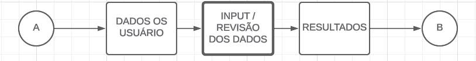
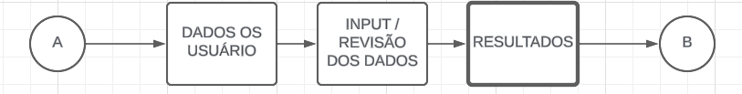
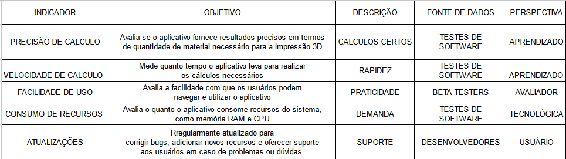

# Especificações do Projeto

Pré-requisitos:<a href="01-Documentação de Contexto.md"> Documentação de Contexto</a>

O aplicativo será desenvolvido como um aplicativo móvel utilizando o framework React Native, permitindo a compatibilidade com dispositivos iOS e Android. O uso de React Native garantirá uma experiência de usuário consistente e fluída em diferentes dispositivos móveis.
O aplicativo será composto por diversos módulos principais:

•	Cadastro de Usuários: Os usuários poderão se cadastrar no aplicativo para acessar todas as funcionalidades oferecidas.
•	Cálculo Simples: Este módulo permitirá aos usuários inserir os valores disponibilizados pelo fatiador, como comprimento utilizado, área do diâmetro do filamento, diâmetro do filamento, peso estimado e tempo de impressão.

•	Valores de Produção: Aqui, os usuários poderão inserir as despesas de produção, como o tipo de filamento, valor do quilo, preço por kWh, consumo da máquina, depreciação por hora e média de falhas.

•	Retorno de Investimento: Este módulo calculará o tempo necessário para o retorno do investimento com base no valor da máquina, horas de operação diárias, dias de operação por mês e valor a ser adicionado por hora.

•	Custos de Produção: Neste módulo, serão calculados os custos de material, energia, manutenção, falhas, acabamento e fixação (spray).

•	Custos Diversos: Aqui, serão calculados os custos diversos, incluindo o retorno de investimento e outros custos adicionais.

•	Resultado: Por fim, o módulo de resultado apresentará o valor de produção, a porcentagem de lucro, o valor de venda sugerido e a margem de lucro.

Este projeto será desenvolvido com foco na usabilidade, precisão e eficiência, visando proporcionar uma ferramenta completa e indispensável para usuários envolvidos no mundo da impressão 3D.

## Personas

1 - Engenheiro Entusiasta - Rafael Silva:
Rafael é um entusiasta de impressão 3D que é apaixonado por tecnologia e engenharia. Ele adora explorar novos materiais e técnicas de impressão 3D para criar protótipos e projetos pessoais.
Rafael passa muito tempo pesquisando e experimentando diferentes configurações de impressão 3D. Ele está interessado em entender os detalhes técnicos por trás do processo de produção.
Ele deseja um aplicativo que ofereça uma análise detalhada dos custos de produção, incluindo o consumo de filamentos e energia, para otimizar seus projetos e reduzir os custos.

2 - Designer Freelancer - Ana Souza:
Ana é uma designer freelancer que utiliza a impressão 3D como parte integrante de seu trabalho. Ela cria modelos 3D para clientes em uma variedade de setores, desde produtos de consumo até protótipos industriais.
Ana trabalha em diversos projetos simultaneamente e precisa gerenciar prazos apertados. Ela valoriza a eficiência e a precisão em seus processos de trabalho.
Ela procura por um aplicativo que simplifique o cálculo dos custos de produção, oferecendo estimativas precisas e rápidas para incorporar em suas propostas de projeto. Além disso, ela precisa de recursos de acompanhamento de tempo para monitorar o tempo gasto em cada projeto.

3 - Empreendedor Iniciante - Lucas Oliveira:
Lucas é um empreendedor que está começando um pequeno negócio de produtos personalizados feitos em impressora 3D. Ele está animado para transformar suas ideias em produtos tangíveis e lucrativos.
Lucas possui habilidades básicas de design e impressão 3D, mas está aprendendo rapidamente. Ele está sempre em busca de orientação e recursos para aprimorar suas habilidades e expandir seu negócio.
Ele busca um aplicativo intuitivo e fácil de usar que forneça uma visão abrangente dos custos envolvidos na produção de seus produtos. Ele valoriza recursos educacionais e suporte ao cliente para ajudá-lo a resolver desafios específicos relacionados à impressão 3D e ao gerenciamento de custos.

## Requisitos

As tabelas que se seguem apresentam os requisitos funcionais e não funcionais que detalham o escopo do projeto.

### Requisitos Funcionais

|ID    | Descrição do Requisito  | Prioridade |
|------|-----------------------------------------|----|
|RF-001| Cadastro de Usuários | ALTA | 
|RF-002| Cálculo de Custos de Produção | ALTA |
|RF-003| Cálculo de Retorno de Investimento(ROI) | ALTA |
|RF-004| Cálculo de Valores de Venda | ALTA |
|RF-005| Interface Intuitiva | MEDIO |

### Requisitos não Funcionais

|ID     | Descrição do Requisito  |Prioridade |
|-------|-------------------------|----|
|RNF-001| Segurança | ALTA | 
|RNF-002| Desempenho |  MÉDIA | 
|RNF-003| Compatibilidade |  MÉDIA | 
|RNF-004| Disponibilidade |  MÉDIA | 
|RNF-005| Precisão dos Cálculos |  ALTA |

Com base nas Histórias de Usuário, enumere os requisitos da sua solução. Classifique esses requisitos em dois grupos:

- [Requisitos Funcionais
 (RF)](https://pt.wikipedia.org/wiki/Requisito_funcional):
 correspondem a uma funcionalidade que deve estar presente na
  plataforma (ex: cadastro de usuário).
- [Requisitos Não Funcionais
  (RNF)](https://pt.wikipedia.org/wiki/Requisito_n%C3%A3o_funcional):
  correspondem a uma característica técnica, seja de usabilidade,
  desempenho, confiabilidade, segurança ou outro (ex: suporte a
  dispositivos iOS e Android).
Lembre-se que cada requisito deve corresponder à uma e somente uma
característica alvo da sua solução. Além disso, certifique-se de que
todos os aspectos capturados nas Histórias de Usuário foram cobertos.

## Histórias de Usuários

Com base na análise das personas forma identificadas as seguintes histórias de usuários:

|EU COMO... `PERSONA`| QUERO/PRECISO ... `FUNCIONALIDADE` |PARA ... `MOTIVO/VALOR`                 |
|--------------------|------------------------------------|----------------------------------------|
|Rafael Silva | análise detalhada dos custos de produção | otimizar seus projetos e reduzir os custos |
|Ana Souza | aplicativo que simplifique o cálculo dos custos de produção| Monitorar tempo e custo  de produção |
|Lucas Oliveira|aplicativo intuitivo e fácil de usar| gerenciamento de custos |

## Modelagem do Processo de Negócio 

### Análise da Situação Atual

Com a popularização da impressora 3d muitos entusiastas começaram a comprar a sua própria, deixando assim de ser um produto voltado aos distribuidores e empresas á algo que possa ser usado por qualquer pessoa. Mesmo sendo para uso pessoal há a necessidade de calcular gastos, sejam eles com materiais ou energia no geral. Por ser um mercado relativamente novo, não existe aplicativos intuitivos ao público-geral que possam auxiliar aqueles com carência de conhecimento nesses calculos que demandão conhecimento mais aprofundado. Nosso aplicativo foca em ajudar a todos nesse meio, possibilitando praticidade e o principal de tudo, cálculos precisos e corretos.

### Descrição Geral da Proposta

Nossa proposta é bem clara, buscamos possibilitar a todos ter ciência sobre os custos finais de cada produção de sua impressora 3d. Esse dados variam claramente de usuário para usuário que terá que manualmente inserir os dados de custos locais, como kiloWatts por hora (energia), valor do material e dados gerais de custos do modelo de sua impressora.

### Processo 1 – COLETANEA DE DADOS LOCAIS DO USUÁRIO

Temos como meta criar uma padronização para esses dados sensíveis, criando assim uma padronização com templates de modelos de impressoras, gastos por empresas de energia, ou padrão de materiais baseados em banco de dados de lojas afiliadas. O proceso inicial demanda que o usuário tenha conhecimento sobre seus gastos em materiais, gasto de energia por hora de sua impressora e quanto é cobrado o kWs pela empresa de energia responável por sua residência.

### Processo 2 – INPUT DE DADOS E ALTERAÇÃO DE DADOS

Buscar uma forma de auto completar os dados do usuário, com base em outros dados fornecidos consientemente por outros usuários, assim buscando agilizar o trabalho manual. O processo é necessário, seria ele o que faz o aplicativo funcionar da forma que deveria é possível tambem alterar esses dados a qualquyer momento, assim buscando diferentes resultados.

### Processo 3 – RESULTADOS

Solicitar ao usuário que compartilhasse os resultados e dados para que possamos melhorar nossa tecnologia. Mostra o resultados dos dados inseridos anteriormente.

## Indicadores de Desempenho

Apresente aqui os principais indicadores de desempenho e algumas metas para o processo. Atenção: as informações necessárias para gerar os indicadores devem estar contempladas no diagrama de classe. Colocar no mínimo 5 indicadores.

Obs.: todas as informações para gerar os indicadores devem estar no diagrama de classe a ser apresentado a posteriori.

## Restrições

O projeto está restrito pelos itens apresentados na tabela a seguir.

|ID| Restrição                                             |
|--|-------------------------------------------------------|
|01| O projeto deverá ser entregue até o final do semestre |
|02| Não pode ser desenvolvido um módulo de backend        |

Enumere as restrições à sua solução. Lembre-se de que as restrições geralmente limitam a solução candidata.

> **Links Úteis**:
> - [O que são Requisitos Funcionais e Requisitos Não Funcionais?](https://codificar.com.br/requisitos-funcionais-nao-funcionais/)
> - [O que são requisitos funcionais e requisitos não funcionais?](https://analisederequisitos.com.br/requisitos-funcionais-e-requisitos-nao-funcionais-o-que-sao/)

## Diagrama de Casos de Uso

O diagrama de casos de uso é o próximo passo após a elicitação de requisitos, que utiliza um modelo gráfico e uma tabela com as descrições sucintas dos casos de uso e dos atores. Ele contempla a fronteira do sistema e o detalhamento dos requisitos funcionais com a indicação dos atores, casos de uso e seus relacionamentos. 

As referências abaixo irão auxiliá-lo na geração do artefato “Diagrama de Casos de Uso”.

> **Links Úteis**:
> - [Criando Casos de Uso](https://www.ibm.com/docs/pt-br/elm/6.0?topic=requirements-creating-use-cases)
> - [Como Criar Diagrama de Caso de Uso: Tutorial Passo a Passo](https://gitmind.com/pt/fazer-diagrama-de-caso-uso.html/)
> - [Lucidchart](https://www.lucidchart.com/)
> - [Astah](https://astah.net/)
> - [Diagrams](https://app.diagrams.net/)

# Matriz de Rastreabilidade

A matriz de rastreabilidade é uma ferramenta usada para facilitar a visualização dos relacionamento entre requisitos e outros artefatos ou objetos, permitindo a rastreabilidade entre os requisitos e os objetivos de negócio. 

A matriz deve contemplar todos os elementos relevantes que fazem parte do sistema, conforme a figura meramente ilustrativa apresentada a seguir.

> **Links Úteis**:
> - [Artigo Engenharia de Software 13 - Rastreabilidade](https://www.devmedia.com.br/artigo-engenharia-de-software-13-rastreabilidade/12822/)
> - [Verificação da rastreabilidade de requisitos usando a integração do IBM Rational RequisitePro e do IBM ClearQuest Test Manager](https://developer.ibm.com/br/tutorials/requirementstraceabilityverificationusingrrpandcctm/)
> - [IBM Engineering Lifecycle Optimization – Publishing](https://www.ibm.com/br-pt/products/engineering-lifecycle-optimization/publishing/)

# Gerenciamento de Projeto

De acordo com o PMBoK v6 as dez áreas que constituem os pilares para gerenciar projetos, e que caracterizam a multidisciplinaridade envolvida, são: Integração, Escopo, Cronograma (Tempo), Custos, Qualidade, Recursos, Comunicações, Riscos, Aquisições, Partes Interessadas. Para desenvolver projetos um profissional deve se preocupar em gerenciar todas essas dez áreas. Elas se complementam e se relacionam, de tal forma que não se deve apenas examinar uma área de forma estanque. É preciso considerar, por exemplo, que as áreas de Escopo, Cronograma e Custos estão muito relacionadas. Assim, se eu amplio o escopo de um projeto eu posso afetar seu cronograma e seus custos.

## Gerenciamento de Tempo

Com diagramas bem organizados que permitem gerenciar o tempo nos projetos, o gerente de projetos agenda e coordena tarefas dentro de um projeto para estimar o tempo necessário de conclusão.

O gráfico de Gantt ou diagrama de Gantt também é uma ferramenta visual utilizada para controlar e gerenciar o cronograma de atividades de um projeto. Com ele, é possível listar tudo que precisa ser feito para colocar o projeto em prática, dividir em atividades e estimar o tempo necessário para executá-las.

## Gerenciamento de Equipe

O gerenciamento adequado de tarefas contribuirá para que o projeto alcance altos níveis de produtividade. Por isso, é fundamental que ocorra a gestão de tarefas e de pessoas, de modo que os times envolvidos no projeto possam ser facilmente gerenciados. 

## Gestão de Orçamento

O processo de determinar o orçamento do projeto é uma tarefa que depende, além dos produtos (saídas) dos processos anteriores do gerenciamento de custos, também de produtos oferecidos por outros processos de gerenciamento, como o escopo e o tempo.

